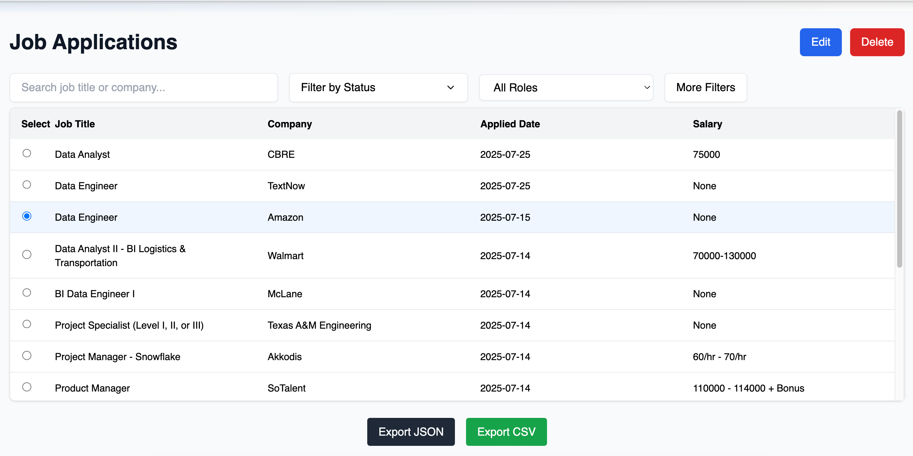
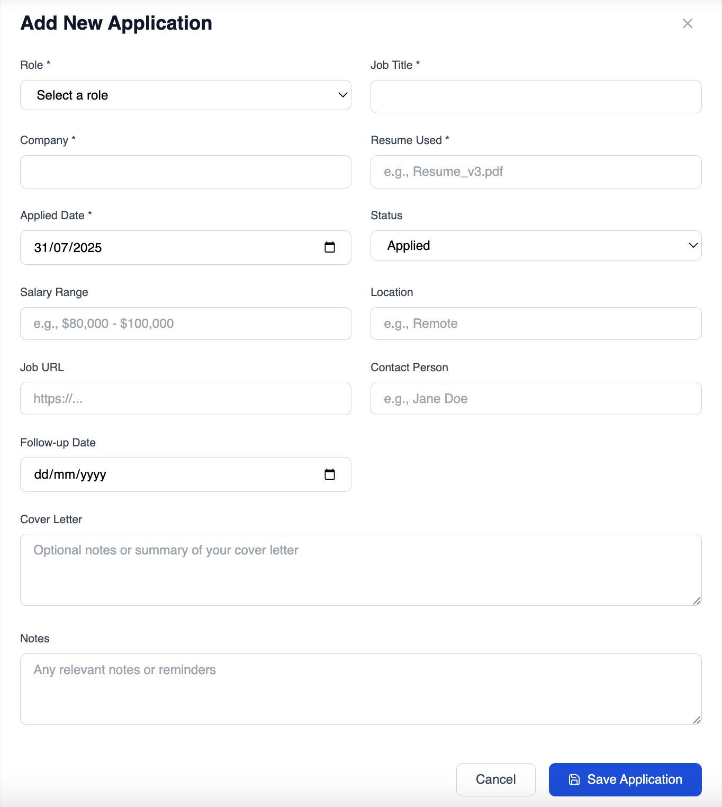
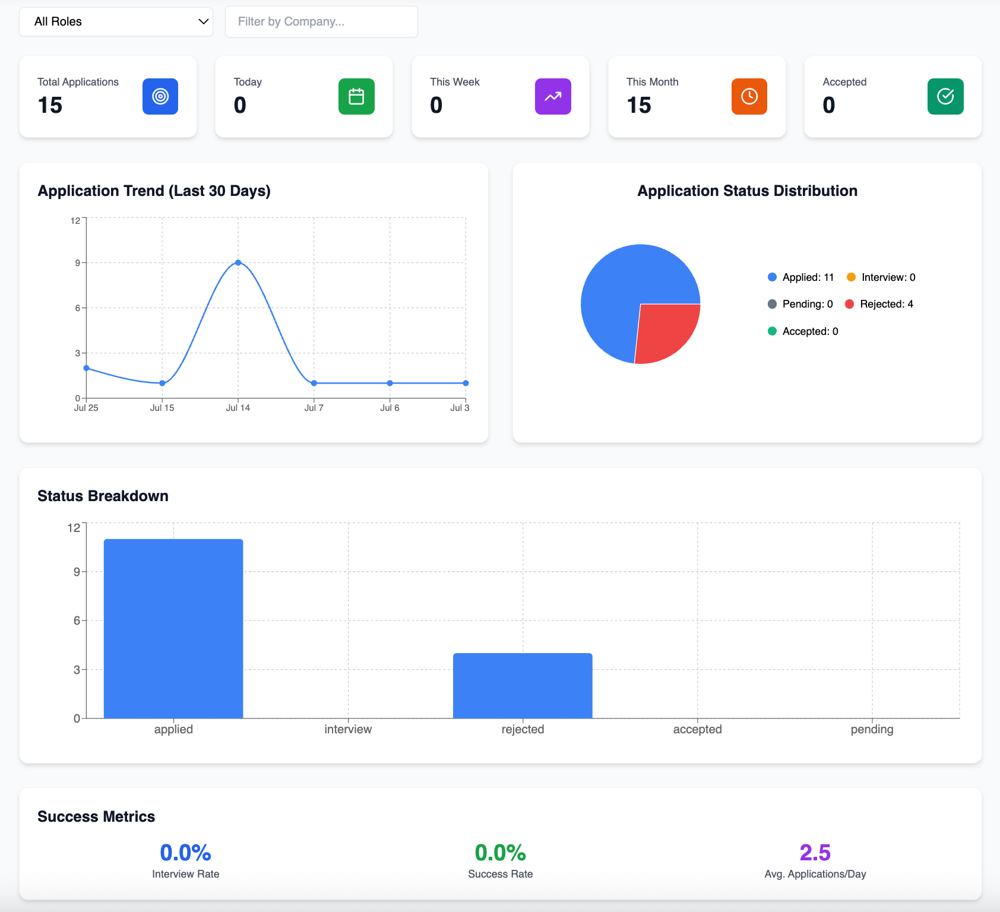

# 📂 HireLog – Job Application Tracker

**HireLog** is a lightweight, cross-platform desktop app to track job applications, visualize application stats, and stay on top of your job hunt — all from your own device with no cloud sync or external dependencies.


---

## 📸 Screenshots

| Applications Page | Add Application | Analytics Dashboard |
|-------------------|-----------------|---------------------|
|  |  |  |

---

## 🧭 Table of Contents

1. [Features](#-features)  
2. [Installation](#-installation)  
3. [Usage](#-usage)  
4. [Tech Stack](#-tech-stack)  
5. [Folder Structure](#-folder-structure)  
6. [Development](#-development)  
7. [Export Support](#-export-support)  
8. [App Icon & Branding](#-app-icon--branding)  
9. [About](#-about)

---

## ✅ Features

- 💼 Add and manage job applications locally  
- 📊 Track application stats (daily/weekly/monthly)  
- 📂 Export applications as `.csv` or `.json`  
- 🔍 Filter, search, and sort applications easily  
- 🧠 Get insights through charts and visualizations  
- ⚡ Fast, secure, and lightweight — built with Electron + SQLite  
- ☁️ No internet required – your data stays with you  

---

## 🛠 Installation

### Mac (.dmg)

1. [Download the `.dmg` file from Releases](https://github.com/goutham2222/HireLog/releases/latest)
2. Open and drag **HireLog** to your Applications folder  
3. Run the app (you may need to allow it in **Gatekeeper** settings)

> 💡 No setup or sign-in required. The app works fully offline.

#### 🚫 Facing issues running the app?

If you're unable to open the app due to macOS security settings:

1. Open **Terminal**  
2. Type the following command (but **don’t press Enter yet**):
   ```bash
   xattr -cr 
3. Open your Applications folder and drag HireLog.app into Terminal
   It should look like:
   ```bash
   xattr -cr /Applications/HireLog.app
4. Press Enter and launch the app again

⚠️ Currently, HireLog is only available for macOS.
Support for Windows and Linux is planned in future updates.

---

## 🚀 Usage

- Click **"Add Application"** to start logging a new job  
- Use the **"Applications"** tab to search, filter, update, or delete entries  
- Navigate to **"Analytics"** to explore application trends and stats  
- Use the **"Export"** button to download your data as CSV/JSON  

---

## 🧰 Tech Stack

- ⚙️ **Electron Forge** – Desktop app framework  
- ⚛️ **React + TypeScript** – Frontend logic and UI  
- 💨 **Tailwind CSS** – Styling with utility classes  
- 📦 **better-sqlite3** – Local database  
- 📈 **Recharts** – Charts and analytics  

---

## 📁 Folder Structure

```
├── assets/ # App-level static assets (if any)
├── node_modules/ # Node dependencies
├── screenshots/ # App UI screenshots for README
├── scripts/ # Utility scripts (e.g., clean-db.js)
├── src/ # Source code
│ ├── components/ # Reusable UI components (Form, Layout, Nav, etc.)
│ ├── hooks/ # Custom React hooks (e.g., useJobApplications)
│ ├── pages/ # Main app views (Applications, Add, Analytics)
│ ├── types/ # TypeScript interfaces and types
│ ├── utils/ # Utility functions (date, filter, stats)
│ ├── App.tsx # Root React component
│ ├── global.d.ts # Global type declarations
│ ├── index.css # Tailwind global styles
│ ├── index.html # Root HTML file for Vite
│ └── main.tsx # React app entry point
├── main.ts # Electron main process entry
├── preload.ts # Electron preload script for IPC
├── README.md # Project documentation
├── vite.main.config.ts # Vite config for Electron main process
├── vite.preload.config.ts # Vite config for preload script
├── vite.renderer.config.ts # Vite config for frontend renderer
├── tsconfig.json # TypeScript compiler config
├── tsconfig.app.json # TypeScript config for renderer
├── tsconfig.node.json # TypeScript config for main/preload
├── tailwind.config.js # Tailwind CSS configuration
├── package.json # Project metadata and scripts
├── package-lock.json # NPM dependency lock file
├── eslint.config.js # ESLint configuration
├── postcss.config.cjs # PostCSS configuration
├── config.json
```
