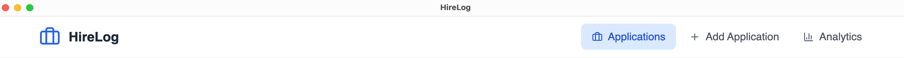

# 📂 HireLog – Job Application Tracker

**HireLog** is a lightweight, cross-platform desktop app to track job applications, visualize application stats, and stay on top of your job hunt — all from your own device with no cloud sync or external dependencies.

---

## 📸 Screenshots

| Applications Page | Add Application | Analytics Dashboard |
|-------------------|-----------------|---------------------|
|  |  |  |

---

## 🧭 Table of Contents

1. [Features](#-features)
2. [Installation](#-installation)
3. [Usage](#-usage)
4. [Tech Stack](#-tech-stack)
5. [Folder Structure](#-folder-structure)
6. [Development](#-development)
7. [Export Support](#-export-support)
8. [App Icon & Branding](#-app-icon--branding)
9. [About](#-about)

---

## ✅ Features

- 💼 Add and manage job applications locally
- 📊 Track application stats (daily/weekly/monthly)
- 📂 Export applications as `.csv` or `.json`
- 🔍 Filter, search, and sort applications easily
- 🧠 Get insights through charts and visualizations
- ⚡ Fast, secure, and lightweight — built with Electron + SQLite
- ☁️ No internet required – your data stays with you

---

## 🛠 Installation

### Mac (.dmg)

1. [Download the `.dmg` file from Releases](#)
2. Open and drag **HireLog** to your Applications folder
3. Run the app (you may need to allow it in Gatekeeper settings)

> 💡 No setup or sign-in required. The app works fully offline.

---

## 🚀 Usage

- Click **"Add Application"** to start logging a new job application
- Use **"Applications"** tab to filter, search, or update
- Navigate to **"Analytics"** to explore trends and performance
- Use the **"Export"** button to back up your data

---

## 🧰 Tech Stack

- ⚙️ **Electron Forge** – Desktop packaging
- ⚛️ **React + TypeScript** – Frontend
- 💨 **Tailwind CSS** – Styling
- 📦 **better-sqlite3** – Local data storage
- 📈 **Recharts** – Analytics & visualization

---

## 📁 Folder Structure

